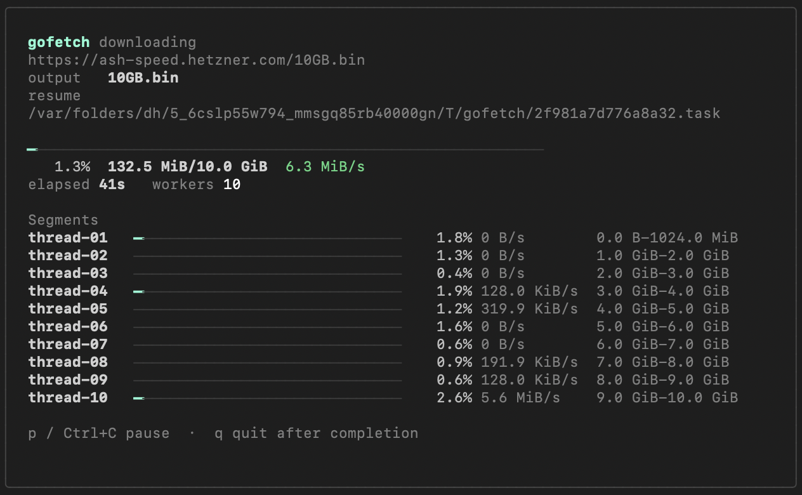

# Gofetch

Gofetch is a native Go download manager with curl-like commands, concurrent segmented downloads, resumable temp state, same-host mirroring, and mirror benchmarking.



## Features

- Concurrent HTTP downloads with configurable workers.
- Segmented `Range` downloads when the server supports byte ranges.
- Terminal UI for live total progress, per-thread progress, and download speed.
- Pause with `p` or `Ctrl+C`, then resume from the task file in `/tmp/gofetch`.
- Temporary `.task` and part files stay out of the working directory and are deleted after a successful download.
- Same-host static mirroring for HTML, CSS, JS, images, fonts, and linked assets.
- Basic mirror benchmarking with latency and throughput ranking.

## Build

```bash
go build -o gofetch ./cmd/gofetch
```

Run without building:

```bash
go run ./cmd/gofetch --help
```

## Commands

Download one URL:

```bash
./gofetch get https://example.com/file.zip
```

Download with more concurrent workers:

```bash
./gofetch get https://example.com/file.zip --workers 10
```

Download URLs from a text file:

```bash
./gofetch get urls.txt --workers 10 --output downloads
```

Mirror a same-host static site:

```bash
./gofetch mirror https://example.com --depth 2 --workers 8 --output mirror
```

Resume a paused download:

```bash
./gofetch resume /tmp/gofetch/<id>.task
```

Benchmark mirrors:

```bash
./gofetch bench https://mirror1.example/file https://mirror2.example/file --samples 3
```

## Pause And Resume

During `get` or `resume`, Gofetch shows a terminal UI with:

- total progress
- per-thread segment progress
- live download speed
- output path
- resume task path

Pause the active download from the UI:

```text
p
```

or:

```text
Ctrl+C
```

The UI prints a resume command using the task file stored in `/tmp/gofetch`. Run that command to continue:

```bash
./gofetch resume /tmp/gofetch/<id>.task
```

When the download completes, Gofetch removes the temp task file and part files automatically. Only the final downloaded file remains in the current directory unless `--output` is provided.

## URL Lists

`urls.txt` should contain one URL per line. Empty lines and lines beginning with `#` are ignored.

```text
https://example.com/a.zip
https://example.com/b.zip
# https://example.com/disabled.zip
```

When downloading from a URL list, `--output` is treated as an output directory. For a single URL, `--output` is treated as the destination file path.

## Testing

The integration tests use local HTTP test servers. In restricted environments, use a writable Go cache:

```bash
GOCACHE=/private/tmp/gofetch-gocache go test ./...
```

If your environment also restricts the module cache:

```bash
GOMODCACHE=/private/tmp/gofetch-gomodcache GOCACHE=/private/tmp/gofetch-gocache go test ./...
```

## Releases

This repo includes a GitHub Actions workflow at `.github/workflows/release.yml`. It builds binaries for macOS, Linux, and Windows, then publishes them as release assets when you push a version tag.

Create a release:

```bash
git add .
git commit -m "Prepare release"
git tag v0.1.0
git push origin main
git push origin v0.1.0
```

GitHub Actions will create the release for `v0.1.0`, attach the binaries, and generate release notes.

Manual release with the GitHub CLI:

```bash
go build -trimpath -ldflags="-s -w" -o gofetch ./cmd/gofetch
gh release create v0.1.0 ./gofetch --generate-notes
```
